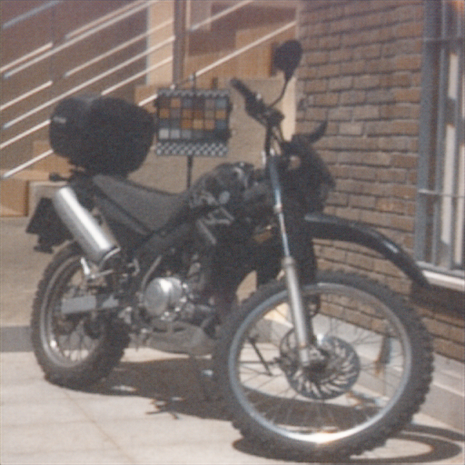

Deep Image Prior（DIP）という論文の再現実装です．
DIPの論文中では通常画像に対してのみ，試していましたが，ハイパースペクトル画像に対しても試してみました．
DIPとはノイズを入力してCNNを学習すると，欠損を含む画像の復元を行うことができたという論文です．
下のようなことができます．
CNNにノイズを入力して，その出力と欠損を含む画像との二乗誤差を最小化するようにCNNを学習すると欠損がない画像が出力されます．

ハイパースペクトル画像にDIPを試した結果です．
結果を確認するために，RGB画像にレンダリングしています．
|欠損画像|CNNの出力|
|---|---|
|||
|||
|||
CNNの出力はインペインティングで1000epoch（iteration）後，デノイズで460epoch後の
結果です．画像の欠損がなく，滑らかな画像が出力されているのがわかります．チェッカーボード上の色の再現は難しいようです．

通常画像の結果です．
ハイパースペクトル画像よりも欠損部分が目立ちました．
|欠損画像|CNNの出力|
|---|---|
||

CNNの出力の推移をGoogle Driveにアップロードしました．
https://drive.google.com/drive/u/0/folders/1cHrEi9T97OeKOdUNolLS_p8uV76XA3YV
# 実行方法
```
git clone https://github.com/wkiino/deep-image-prior.git
cd deep-image-prior
```
datasets/hsimgの下にハイパースペクトル画像をダウンロードします．
```
curl -O http://colorimaginglab.ugr.es/pages/data/hyperspectral/scene9_sp/! ./datasets/hsimg/data.tiff
```
必要に応じて，パッケージをインストールしてくださ．
```
pip3 install -r requirements.txt
```
ハイパースペクトル画像ではインペインティング2種類とデノイズを試すことができます．image.typeにinpaint1，inpaint2，denoiseを指定するとできます．結果はdeep-image-prior/outputの下に保存されます．

実行例
ハイパースペクトル画像に試す場合

```
cd src
python3 train.py image.type=inpaint1 base_options.epochs=1000
```
他のマスク画像を試す場合
```
cd src
python3 train.py image.type=inpaint2 base_options.epochs=1000
```

デノイズを試したい場合
```
cd src
python3 train.py image.type=denoise base_options.epochs=1000
```


また，GPUがない環境で高速に試したり，python環境を壊さずに利用できるように，google colaboratory上で動かせるノートブックも作成しました．ハイパースペクトル画像を使ったり，CNNの出力の変化の動画を作成する関係でgoole driveに数百MB程度の空き容量が必要です．
deep-image-prior.ipynbをgoogle driveにアップロードしてgoogle colaboratoryことで試すことができます．


# リンク
スペインの大学で公開されているハイパースペクトル画像を利用しています[1]． 
[1]http://colorimaginglab.ugr.es/pages/Data#__doku_ishihara_spectral_database．

Deep Image Priorの論文とGithubのページです．

論文
https://sites.skoltech.ru/app/data/uploads/sites/25/2018/04/deep_image_prior.pdf

GitHub

https://github.com/DmitryUlyanov/deep-image-prior

また，パラメーター管理のためにHydraを利用しています．
https://hydra.cc/docs/intro